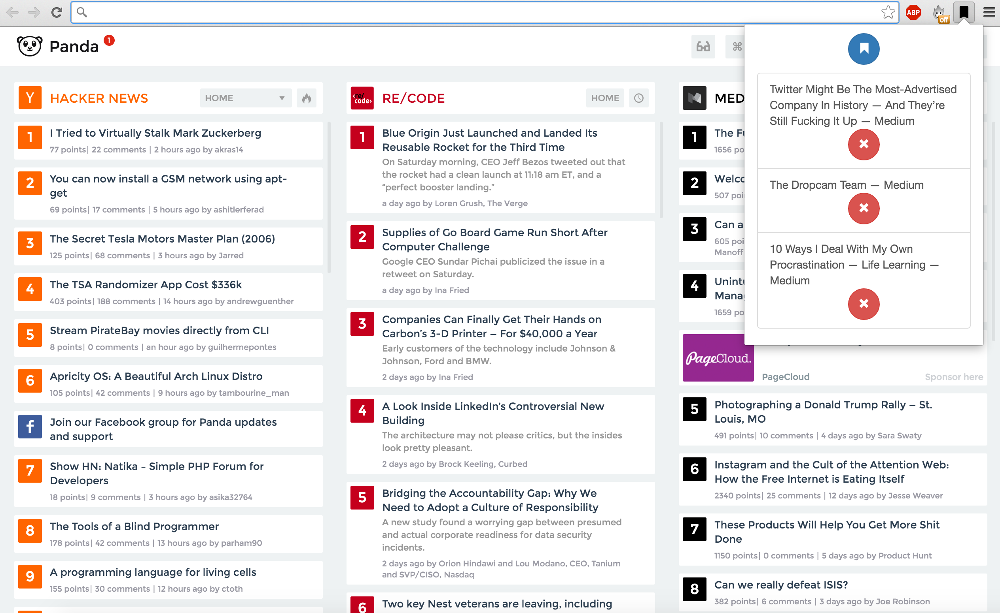

Temporary Bookmark Manager
==========================
A common problem with browser bookmarks is the storage of a large number of items that are rarely if ever used. These bookmarks clog up a users bookmark structure and detract from the usefulness of bookmarks as a feature.

This program acts as a temporary bookmark manager built as an extension for the chrome browser.

In its current version the program creates a separate storage area for short-life bookmarks within a separate short-life folder. Any bookmarks saved to this folder are accessible through the normal chrome interface but have a __life-span of seven days__ after which they will are automatically removed. If within this timeframe they are moved to a new folder they will continue to exist as normal bookmarks.

Bookmarks can be added (using the blue bookmark button) and deleted (using the individual red delete button) at will through the Application interface in the top right corner of the chrome browser as seen in the image below:



Installation and Usage
======================

This extension is not currently published on the google extensions store. However, if you would like to use the code clone this git repository
```
git clone https://github.com/ALRW/temp_bm_manager.git
```
Then open a new google chrome browser window and visit
```
chrome://extensions
```
Tick the box to enable developer mode and click Load unpacked extension to load the clones repository. Then use as described above.
